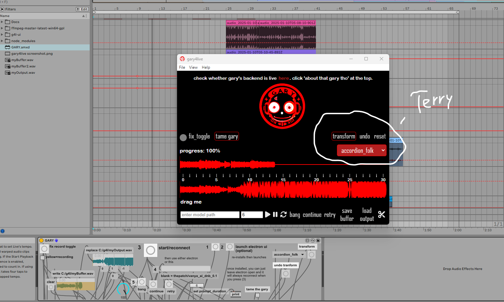

# gary4live mac version

## update jan 12 2025 - now with melodyflow (aka terry)



gary does musicgen continuations using input audio you record from inside ableton. Now, we have terry thanks to this repo from meta:

https://huggingface.co/spaces/facebook/melodyflow

terry will transform your input audio and give you back audio the same length. we have a bunch of 'presets' we made for terry. you can have terry transform the outputs gary produced, too. up to 40 seconds.


in this version, gary expects to be placed in `/Applications/g4l/GARY_mac.amxd`

the `.app` file expects to be in `/Applications/g4l/g4l-ui/release/build/mac/gary4live.app`

**IF YOU CHOOSE TO CHANGE FILEPATHS:**

`commentedout.js`, `electron_communication.js`, and `launch_electron.js` will need to be changed.

if you want to run gary's electron ui in dev mode:

1. clone this repo:
```
git clone https://github.com/betweentwomidnights/gary-mac.git
```

2. install nvm:
```
curl -o- https://raw.githubusercontent.com/nvm-sh/nvm/v0.39.0/install.sh | bash
```

3. re-open terminal and run:
```
export NVM_DIR="$HOME/.nvm"
[ -s "$NVM_DIR/nvm.sh" ] && \. "$NVM_DIR/nvm.sh"
[ -s "$NVM_DIR/bash_completion" ] && \. "$NVM_DIR/bash_completion"
```

4. install and use Node 18:
```
nvm install 18
nvm use 18
```

5. navigate to project and start:
```
cd gary-mac/g4l-ui
npm install
npm run start
```

to build the app:
```
npm run package
```

the app will be built to `g4l/g4l-ui/release/build/mac/gary4live.app`. you'll find that manually starting electron has no problem communicating with the max for live device from anywhere on the machine.

the max4live UI does almost everything that the electron UI does. It doesn't have a crop function, and you can't drag/drop your waveform in, but it will work. i tried to make electron as optional as i could.

you can talk to our backend using the url `https://g4l.thecollabagepatch.com` in `commentedout.js`

for now... if our backend goes down, though, it can be built yourself using this repo and 'Rosetta 2' I'm told: https://github.com/betweentwomidnights/gary-backend-combined

## as of jan 2025 I am actively working on making the docker-compose agnostic to devices so that Apple Silicon can run it with gpu acceleration


there are several backend types in that repo. `g4lwebsockets` is the one you'll be spinning up using docker-compose.

yell at me on discord https://discord.gg/VECkyXEnAd

yell at me on twitter [@thepatch_kev](https://twitter.com/@thepatch_kev)

there are many demos of this plugin being used on youtube:
- [@thepatch_dev](https://youtube.com/@thepatch_dev)
- [@thecollabagepatch](https://youtube.com/@thecollabagepatch)

a special thanks to lyra for the fine-tuning help that made this plugin interesting.
